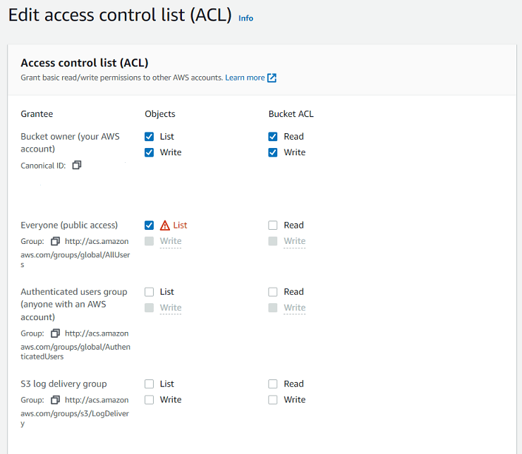

# Continuous Deployment of SPA on AWS S3

This project was generated with [Angular CLI](https://github.com/angular/angular-cli) version 16.0.4.

---

📺 YouTube video: https://youtu.be/Bv2xX4LQqII

📊 Test report: https://showmeyourcodeyoutube.gitlab.io/continuous-deployment-spa-application-on-aws-s3/unit-tests/index.html

📄 AWS S3: http://aws-spa-tutorial.s3-website.eu-central-1.amazonaws.com

🔴 AWS Service Status: https://downdetector.com.au/status/aws-amazon-web-services/

## What is continuous deployment?

Continuous deployment is a strategy in software development where code changes to an application are released automatically into the production environment.

Reference: https://www.ibm.com/topics/continuous-deployment

## What is single-page application (SPA)?

An SPA (Single-page application) is a web app implementation that loads only a single web document, and then updates the body content of that single document via JavaScript APIs such as XMLHttpRequest and Fetch when different content is to be shown. 

Reference: https://developer.mozilla.org/en-US/docs/Glossary/SPA

## What is Amazon S3?  

Amazon Simple Storage Service (S3) is a storage that can be maintained and accessed over the Internet. Amazon S3 provides a web service that can be used to store and retrieve an unlimited amount of data. It is global by default and buckets are region specified. There are different types of S3 storage, for example S3 Standard, S3 Standard-IA (Infrequent Access) or S3 Intelligent-Tiering.

Reference: https://k21academy.com/amazon-web-services/amazon-s3-bucket-and-storage-classes/

## Manual steps for S3 bucket creation

1. Set properly `Object Ownership`.
   1. As we are going to upload files to a bucket using AWS CLI, `ACLs enabled` should be checked.  
   
2. Allow objects access using ACLs.
   1. While uploading files, we are going to use ACL.  
   
3. Enable `Static website hosing`.
   1. As we want to access the page using a predefined URL, checked this option.  
   
4. Edit ACL and allow everyone reads objects.
   1. As our page is going to be public, everyone should be able to access it.  
   

## Angular notes

- Generate Karma configuration
```
ng generate config karma
```
